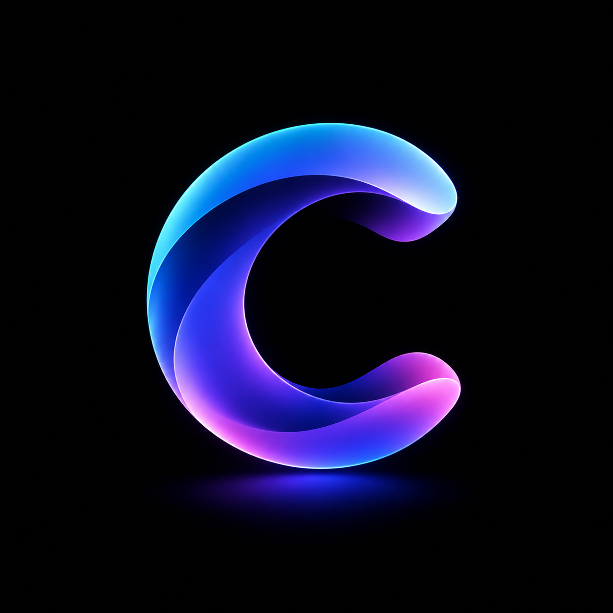
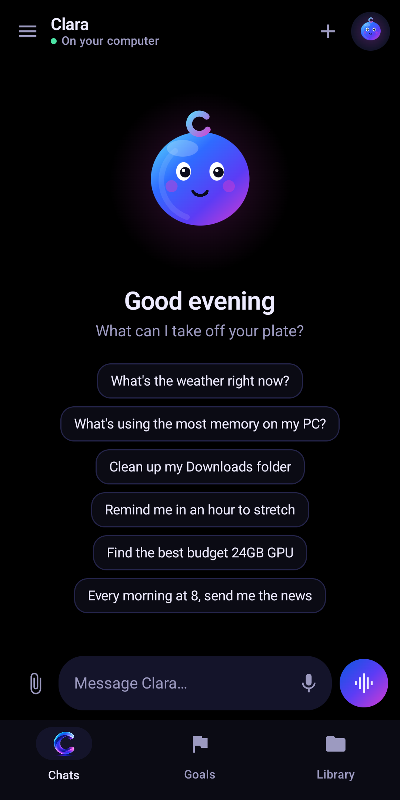
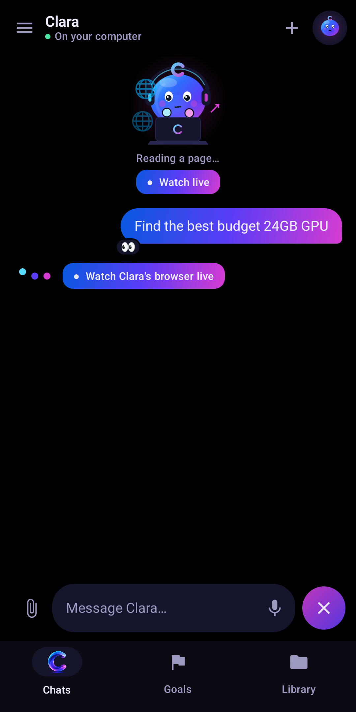
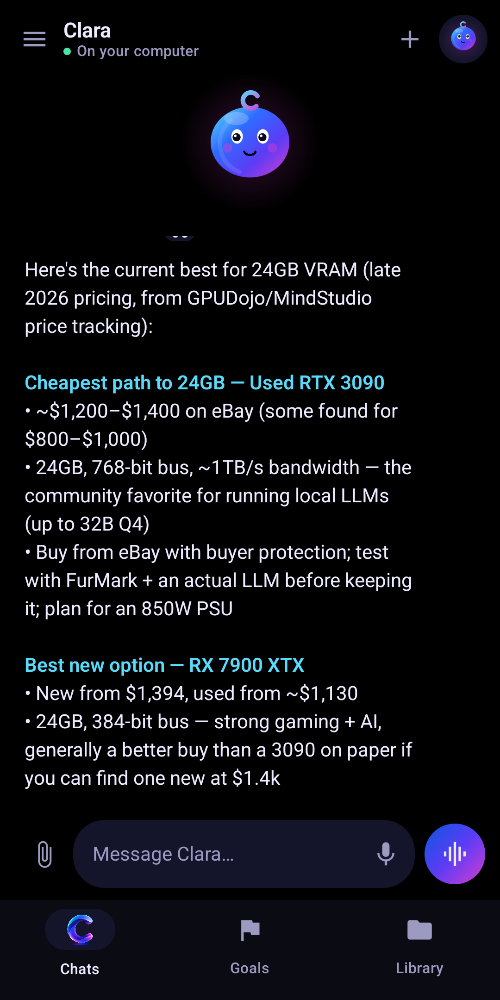
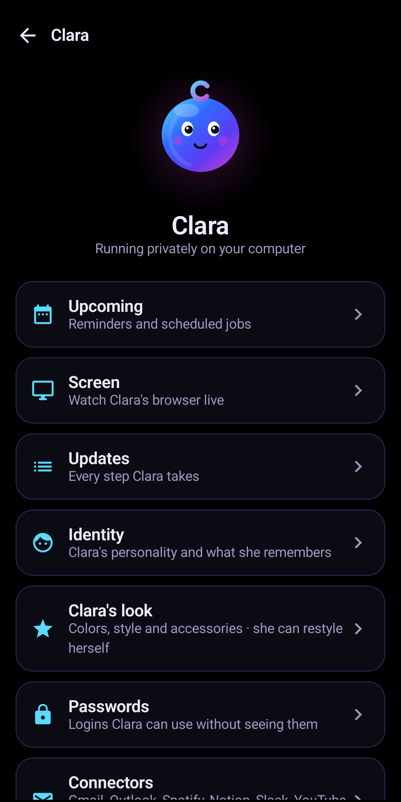
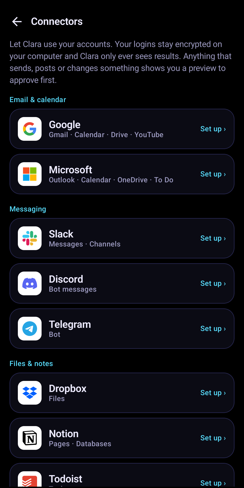

<p align="center"></p>

<h1 align="center">Clara</h1>
<p align="center"><b>A private AI assistant that runs on your own PC, with a phone app to talk to her.</b><br>
Free and open source. No subscription. Your chats, files and memories never leave your computer.<br>
<a href="https://clara.thewiderlens.info">clara.thewiderlens.info</a> · <a href="https://github.com/TheWiderLensInitiative/clara/releases/latest">Download the app</a></p>

<p align="center">
<a href="https://github.com/TheWiderLensInitiative/clara/releases/latest"></a>
<a href="LICENSE"></a>
<a href="https://github.com/TheWiderLensInitiative/clara/releases"></a>
<a href="https://huggingface.co/TheWiderLensInitiative/laya-for-clara"></a>
<a href="https://clara.thewiderlens.info/beta"></a>
</p>

<p align="center">





</p>

<p align="center">▶️ <a href="https://www.youtube.com/watch?v=42DrnEKDVrE"><b>Watch the 1-minute demo</b></a> · 🧪 <a href="https://clara.thewiderlens.info/beta"><b>Join the beta</b></a> · ⭐ Star the repo if you'd like to see Clara grow</p>

---

Clara is a personal agent: she doesn't just chat, she **does things** on her own computer, like browsing the web,
managing reminders, reading your email and calendar, organizing files, running code and making videos. Big actions
always come to your phone for an OK first.

Her brain is **Bonsai 2 27B**, running on your NVIDIA GPU. Her agent is **Hermes**. A small router, **Laya**, decides in
a third of a second whether a message is a quick chat or a real task. Everything stays on your hardware, unless you turn
on cloud help for a specific job and approve it.

## What she can do

- **One ongoing chat** with an animated character who shows what she's doing (typing, browsing, thinking…)
- **Tasks on her own sandboxed computer:** web research, files, code, a live browser you can watch and take over
- **Reminders and scheduled jobs**, delivered to your phone
- **Approvals:** sending, deleting, buying, installing and anything risky asks you first, with a preview
- **Voice mode:** talk hands-free; she answers with a natural local voice
- **Photos and files:** send a picture and she sees it; send a document and she reads it
- **Goals and check-ins**, plus a morning note with suggestions
- **Connectors:** Gmail and Google Calendar, Outlook, Spotify, Notion, Todoist, GitHub, Slack, Discord, Telegram, Dropbox,
  Home Assistant, and YouTube posting. Your logins stay encrypted on your PC; Clara only sees results.
- **Passwords stay on your phone:** she can use a saved login without ever seeing it
- **Optional cloud boost** through your own [OpenRouter](https://openrouter.ai) account for heavy coding, pictures, videos,
  ads and music, with per-task approval, daily and monthly caps, and a spending dashboard
- **Social videos and ads** with captions, your brand kit, music and an end card
- **She can restyle herself** ("make yourself purple with cat ears"), and you can undo it
- **Use her from anywhere** through [Tailscale](https://tailscale.com), privately

## What you need

| | Minimum |
|---|---|
| GPU | NVIDIA, **12 GB VRAM** or more (tested on an RTX 3060 12 GB) |
| RAM | 16 GB (32 GB recommended) |
| Disk | 40 GB free |
| OS | Ubuntu 24.04 or newer (other Debian-based distros may work) |
| Phone | Android 9 or newer |

## Install

```bash
git clone https://github.com/TheWiderLensInitiative/clara ~/clara
cd ~/clara
./install.sh
```

It takes 20–40 minutes, mostly downloading the model. At the end it prints a **computer address** and a **pairing code**.
Install the Clara app on your phone, connect to the same Wi-Fi, and enter both.

To use Clara away from home: `sudo sh setup/tailscale.sh`, then install the Tailscale app on your phone and sign in with
the same account. Details are in [docs/INSTALL.md](docs/INSTALL.md).

Everyday commands: `clara status`, `clara pair`, `clara logs`, `clara restart`, `clara update`.

## How it works

```
  Phone app  ──Wi-Fi or Tailscale──▶  Clara Bridge (your user, CPU)
                                        ├─ Laya router: chat / task / reminder, quick or deep
                                        ├─ chat ───────────────▶ Bonsai 2 27B (llama-server, GPU)
                                        └─ tasks ──▶ Hermes agent (as the sandboxed "clara" user)
                                                       ├─ tools: browser, terminal, files, search (SearXNG)
                                                       ├─ Guardian: approval rules she can't change
                                                       └─ plugins ──▶ back to the Bridge for passwords,
                                                                       accounts, cloud boost, voice, video
```

More in [docs/ARCHITECTURE.md](docs/ARCHITECTURE.md). What leaves your PC and when: [docs/PRIVACY.md](docs/PRIVACY.md).

## Project layout

| Folder | What's in it |
|---|---|
| `bridge/` | The Clara Bridge (Python/FastAPI): phone API, router, approvals, voice, video, connectors |
| `hermes/` | Clara's agent setup: personality, config template, plugins (Guardian, vault, connectors, cloud, link) |
| `android/` | The Android app (Kotlin, Jetpack Compose) |
| `laya/` | Training data and scripts for the router ([laya-for-clara on Hugging Face](https://huggingface.co/TheWiderLensInitiative/laya-for-clara)) |
| `setup/` | Service files, the `clara` command, Tailscale setup |
| `tools/` | Development helpers (fake Google and other test servers) |

## Credits

Clara stands on the shoulders of [Hermes Agent](https://github.com/NousResearch/hermes-agent) (Nous Research),
[Bonsai](https://github.com/PrismML-Eng/Bonsai-demo) (PrismML), [Laya](https://huggingface.co/convaiinnovations/laya)
(ConvAI Innovations), [Kokoro](https://huggingface.co/hexgrad/Kokoro-82M), [SearXNG](https://github.com/searxng/searxng)
and more; see [NOTICE](NOTICE).

## License

Apache-2.0. Created by DevIgnite × The Wider Lens Initiative Project.
